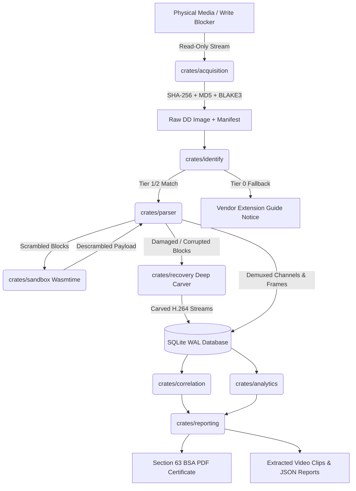

# System Architecture & Technical Specification

**Project**: Open Digital Video Forensics Platform for CCTV/DVR/NVR Systems  
**Initiative**: Smart India Hackathon (SIH 2025) | Team Cyber 4  
**Classification**: System Architecture Document (SAD)  
**Version**: 1.0.0  

---

## 1. Architectural Philosophy & Principles

The Open Digital Video Forensics Platform is an air-gapped, zero-cloud, multi-crate Rust workspace designed for law enforcement examiners, digital forensic laboratories, and courtroom evidentiary compliance.

The architecture adheres to four non-negotiable forensic engineering axioms:
1. **Strict Read-Only Immutability**: All physical media and image accesses are opened strictly in read-only mode (`O_RDONLY` / read-only file handles). Zero writes occur on source evidence.
2. **Cryptographic Multi-Hashing at Ingestion**: Acquisition streams dual whole-image hashes (SHA-256 and MD5) concurrently with per-block BLAKE3 integrity trees.
3. **Deterministic Sandbox Isolation**: Untrusted or reverse-engineered vendor descramblers execute inside WebAssembly (`wasmtime 24`) containers constrained by hard memory ceilings and execution timeouts.
4. **Section 63 BSA, 2023 Evidentiary Admissibility**: All extracted frames, timeline correlations, and tampering anomalies trace back to physical drive block offsets and generate verifiable legal certificate documents.

---

## 2. Workspace Crate Topology

The platform comprises **10 specialized modular crates** operating within a unified Cargo workspace:

```
                                  [ dvrft (CLI) ]       [ gui (Desktop Web UI) ]
                                         \                     /
                                          \                   /
                                   +--------------------------------+
                                   |         Orchestration          |
                                   +--------------------------------+
                                        /         |          \
                                       /          |           \
                    +--------------------+        |        +--------------------+
                    |  crates/identify   |        |        | crates/acquisition |
                    +--------------------+        |        +--------------------+
                               |                  |                   |
                               v                  v                   v
                    +--------------------+  +------------+  +--------------------+
                    |   crates/parser    |->| SQLite WAL |<-|  crates/recovery   |
                    +--------------------+  |  Database  |  +--------------------+
                               |            +------------+            |
                               v                  ^                   v
                    +--------------------+        |         +--------------------+
                    |   crates/sandbox   |        |         |  crates/analytics  |
                    +--------------------+        |         +--------------------+
                                                  v
                                        +--------------------+
                                        | crates/correlation |
                                        +--------------------+
                                                  |
                                                  v
                                        +--------------------+
                                        |  crates/reporting  |
                                        +--------------------+
```

### 2.1. Crate Directory & Responsibility Matrix

| Crate Path | Crate Name | Primary Role & Capabilities |
| :--- | :--- | :--- |
| `crates/acquisition` | `acquisition` | Bit-stream raw drive streaming, dual whole-image hashing (SHA-256 + MD5), 512 KiB per-block BLAKE3 hashing, forensic manifest generation. |
| `crates/dvrft-gen` | `dvrft-gen` | Synthetic disk generator creating clean-room `C4FS` multi-channel disks, XOR-scrambled streams, damaged headers, and ground-truth manifests. |
| `crates/identify` | `identify` | Pre-acquisition header interrogation, SoC architecture mapping, fuzzy heuristics, and multi-tier OEM confidence scoring. |
| `crates/parser` | `parser` | Declarative YAML DSL interpreter, superblock and video block parser, channel demuxing, UTC timestamp normalization, and SQLite ingestion. |
| `crates/sandbox` | `sandbox` | Wasmtime 24 embedded WebAssembly runner enforcing 16 MiB memory limits and 500 ms epoch interruption timeouts for vendor descrambling. |
| `crates/recovery` | `recovery` | Deep H.264 NAL carver (`00 00 00 01 67`/`41`), LBA-level tamper detection (`dvrft verify`), and orphan frame recovery from damaged blocks. |
| `crates/correlation`| `correlation` | Multi-camera temporal-spatial fusion, cross-camera subject transition tracking, and synchronous multi-camera blackout detection. |
| `crates/analytics` | `analytics` | Lightweight visual motion energy estimation, bounding box entity proposals (`Person`, `Vehicle`, `Face`, `MotionCluster`), and relevance ranking. |
| `crates/reporting` | `reporting` | Timeline discontinuity auditor, Section 63 BSA legal certificate PDF generator (`printpdf`), raw `.h264` stream exporter, and JSON report generator. |
| `crates/gui` | `gui` | Embedded desktop web server (`tiny_http`) serving a zero-dependency, 5-screen dark-theme forensic workstation without CLI shelling. |

---

## 3. Forensic Ingestion & Processing Pipeline



### 3.1. Stage 1: Acquisition & Identification
1. The physical surveillance disk or raw image is opened via `crates/acquisition::acquire_image()`.
2. As bytes stream from the source, incremental SHA-256 and MD5 digesters run concurrently alongside BLAKE3 block chunkers.
3. An acquisition manifest (`acquisition_manifest.json`) records device metadata, sector counts, timestamps, and multi-hashes.
4. `crates/identify::identify_device()` scans Sector 0 and heuristic offsets against known grammars and the vendor registry to return a confidence score and SoC profile.

### 3.2. Stage 2: Parsing, Descrambling, and Deep Carving
1. `crates/parser::parse_case()` loads the appropriate grammar (`c4fs-v1.yaml`, `hikvision-v1.yaml`, or `dahua-v1.yaml`).
2. Superblocks are validated. If block headers flag scrambling, payloads are routed to `crates/sandbox::SandboxManager` where `c4_xor_descrambler.wasm` runs under hardware memory constraints.
3. If blocks fail CRC/checksums or headers are damaged, `crates/recovery::carve_h264_stream()` scans raw sector spans for H.264 SPS (`0x67`), PPS (`0x68`), and IDR (`0x65`) NAL units.
4. Extracted frames are stored in SQLite with normalized UTC ISO 8601 timestamps.

### 3.3. Stage 3: Correlation & Visual Analytics
1. `crates/correlation::Correlator` merges multi-camera event sequences into monotonic order, calculates transition latencies between cameras, and flags concurrent feed outages (power cuts / sabotaged lines).
2. `crates/analytics::VisualAnalytics` computes motion energy gradients across frame payloads, proposing entity bounding boxes (`Person`, `Vehicle`, `Face`, `MotionCluster`) to prioritize high-activity footage.

### 3.4. Stage 4: Court Certification & Reporting
1. `crates/reporting::generate_bsa_certificate()` compiles disk metadata, dual whole-image hashes, examiner credentials, tool versions, and timeline statistics into a legally valid Section 63 BSA PDF using `printpdf`.
2. Extracted video streams are assembled into standalone `.h264` elementary stream files.

---

## 4. SQLite WAL Database Schema Specification

All parsed metadata, carved frames, and analytics results reside in a high-concurrency SQLite database operating in Write-Ahead Logging (`WAL`) mode (`synchronous = NORMAL`):

```sql
-- 1. Cases Table: Top-level investigation metadata
CREATE TABLE cases (
    id TEXT PRIMARY KEY,
    case_number TEXT NOT NULL,
    investigator TEXT NOT NULL,
    notes TEXT,
    created_at TEXT NOT NULL
);

-- 2. Disks Table: Acquired physical drives and forensic images
CREATE TABLE disks (
    id TEXT PRIMARY KEY,
    case_id TEXT NOT NULL,
    device_path TEXT NOT NULL,
    total_bytes INTEGER NOT NULL,
    sector_size INTEGER NOT NULL,
    sha256_hash TEXT NOT NULL,
    md5_hash TEXT NOT NULL,
    grammar_used TEXT,
    created_at TEXT NOT NULL,
    FOREIGN KEY(case_id) REFERENCES cases(id)
);

-- 3. Blocks Table: Individual physical block descriptors & integrity state
CREATE TABLE blocks (
    id TEXT PRIMARY KEY,
    disk_id TEXT NOT NULL,
    lba_offset INTEGER NOT NULL,
    size_bytes INTEGER NOT NULL,
    channel_id INTEGER NOT NULL,
    is_allocated INTEGER NOT NULL,
    is_damaged INTEGER NOT NULL,
    is_scrambled INTEGER NOT NULL,
    blake3_hash TEXT NOT NULL,
    FOREIGN KEY(disk_id) REFERENCES disks(id)
);

-- 4. Streams Table: Multi-channel surveillance video streams
CREATE TABLE streams (
    id TEXT PRIMARY KEY,
    disk_id TEXT NOT NULL,
    channel_id INTEGER NOT NULL,
    codec TEXT NOT NULL,
    frame_count INTEGER NOT NULL,
    start_time TEXT,
    end_time TEXT,
    FOREIGN KEY(disk_id) REFERENCES disks(id)
);

-- 5. Frames Table: Individual video frame metadata and offsets
CREATE TABLE frames (
    id TEXT PRIMARY KEY,
    stream_id TEXT NOT NULL,
    frame_type TEXT NOT NULL,
    timestamp TEXT NOT NULL,
    byte_offset INTEGER NOT NULL,
    size_bytes INTEGER NOT NULL,
    is_carved INTEGER NOT NULL,
    FOREIGN KEY(stream_id) REFERENCES streams(id)
);

-- 6. Correlations Table: Multi-camera transitions and temporal anomalies
CREATE TABLE correlations (
    id TEXT PRIMARY KEY,
    case_id TEXT NOT NULL,
    from_camera TEXT NOT NULL,
    to_camera TEXT NOT NULL,
    transition_time TEXT NOT NULL,
    confidence REAL NOT NULL,
    notes TEXT,
    FOREIGN KEY(case_id) REFERENCES cases(id)
);

-- 7. Analytics Detections Table: Motion energy and entity proposals
CREATE TABLE analytics_detections (
    id TEXT PRIMARY KEY,
    frame_id TEXT NOT NULL,
    channel_id INTEGER NOT NULL,
    timestamp TEXT NOT NULL,
    motion_energy REAL NOT NULL,
    detected_entities TEXT NOT NULL,
    bounding_box TEXT,
    relevance_score REAL NOT NULL,
    FOREIGN KEY(frame_id) REFERENCES frames(id)
);
```

---

## 5. Security & Isolation Architecture

### 5.1. Hardware Isolation (Physical Media Protection)
- Hardware write-blockers (e.g., Tableau T8u, WiebeTech UltraDock) must be placed between evidence drives and examiner workstations.
- Software-level safety: `crates/acquisition` opens handles using `File::open()` with zero mutable handles or write buffers.

### 5.2. WebAssembly Sandbox Isolation
Untrusted descramblers and reverse-engineered decoders run in isolated WebAssembly runtimes:
```
+--------------------------------------------------------------+
| Host Environment (Rust Native Process)                      |
|                                                              |
|   +------------------------------------------------------+   |
|   | Wasmtime 24 Engine                                   |   |
|   |   - Memory Limit: 16 MiB Max Heap                    |   |
|   |   - Watchdog: 500 ms Execution Epoch Timeout         |   |
|   |   - No Network, Filesystem, or System Call Access    |   |
|   |                                                      |   |
|   |   +----------------------------------------------+   |   |
|   |   | Guest Wasm Module (c4_xor_descrambler.wasm)  |   |   |
|   |   |  - descramble(ptr, len, key)                 |   |   |
|   |   +----------------------------------------------+   |   |
|   +------------------------------------------------------+   |
+--------------------------------------------------------------+
```

---

## 6. Court Admissibility & Legal Framework

### 6.1. Section 63 Bharatiya Sakshya Adhiniyam (BSA), 2023
The platform's PDF reporting subsystem generates a Section 63 BSA certificate that fulfills all legal mandates:
1. **Source Identification**: Identifies the physical device, manufacturer, serial number, and hardware configuration.
2. **Hash Authentication**: Records whole-image dual hashes (SHA-256 and MD5) captured at acquisition and re-verified at reporting.
3. **Chain of Custody**: Logs date, time, operating system, software version, and examiner identity.
4. **Tool Integrity Statement**: Attests that the computing device was operating properly and that processing did not alter evidence contents.
